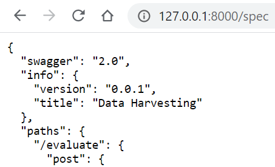
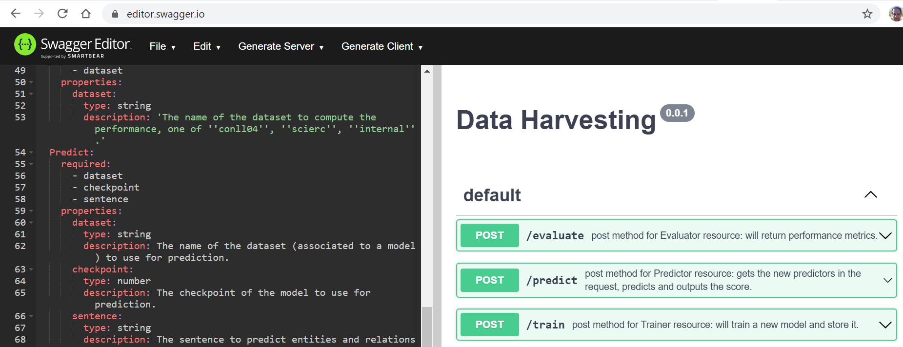

# Renard Joint

Renard is an NLP software suite developed internally at Crédit Agricole.

This open-source project, dubbed `renard_joint`, is a component of this suite which deals with joint entity and relation
extraction. The repository provides a **pipeline** and an implementation of **SpERT**[[1]](#1) for joint entity and 
relation extraction. The pipeline consists of a simple entity recognition and a multiple relation extraction[[2]](#2) 
model. The main contribution, described in a paper accepted for publication (proceedings to be published later) at 
[SoGood2021](https://sites.google.com/view/ecmlpkddsogood2021/home), is that we provide a model trained on Environmental,
Social and Governance reports, as well as Corporate Social Responsability (CSR) reports annotated by analysts at Crédit
Agricole, such that these can be analyzed automatically.

Current test coverage on internal Gitlab platform: 89 %.

**Table of contents:**

- [Installation](#installation)
- [Documentation](#documentation)
- [Structure](#structure)
- [Usage](#usage)
- [Disclaimer](#disclaimer)

## Installation

### As a Python package

- Clone this repository: `git clone https://github.com/adimajo/renard_joint.git` or `git clone git@github.com:adimajo/renard_joint.git`;
- Set the environment variables `DATA` and `MODEL` to the location of your choice (`data` and `model` by default resp., see below);
- Have a working python development environment, including the `pip` package manager;
- Install `pipenv` with `pip install pipenv`;
- Install the python dependencies of this package using: `pipenv install`;
- If not on Linux, install Torch following [their instructions](https://pytorch.org/get-started/locally/);
- Install the package using: `pip install .` (append `pipenv run` if the virtual environment created by `pipenv` hasn't been activated, e.g. in a script).

### As a Flask API

#### Development server

- Clone this repository: `git clone https://github.com/adimajo/renard_joint.git` or `git clone git@github.com:adimajo/renard_joint.git`;
- Set the environment variables `DATA` and `MODEL` to the location of your choice (`data` and `model` by default resp., see below);
- Have a working python development environment, including the `pip` package manager;
- Install `pipenv` with `pip install pipenv`;
- Install the python dependencies of this package using: `pipenv install`;
- Fire up the Flask API locally using `python API/wsgi.py`.

#### Production server

##### Locally - gunicorn

Alongside the project's dependencies, the `gunicorn` server should have 
been installed. To use it:
`gunicorn API/wsgi:app --bind 0.0.0.0:8000`

##### Docker container

A docker container .

## Documentation

The Sphinx documentation is available [as a Github Page](https://adimajo.github.io/renard_joint).

It can be built by running:
```
$ cd docs
$ make html
```

The API's documentation is available as a Swagger, at the `/spec` endpoint.

Thus, once deployed, *e.g.* on localhost, the `/spec` endpoint will return:


Then, a Swagger reader is necessary to turn this json file into a webpage documentation.
Copy-pasting it on [https://editor.swagger.io/](https://editor.swagger.io/), we get:


## Structure

### Directory

- `API/` contains the Flask API development server, its so-called "resources" and the Dockerfile to run it as a container;
- `renard_joint/` contains the main package;
- `notebooks/` contains the notebooks to explore the datasets and fine-tune the model;
- `tests/` contains the `pytest` tests for `renard_joint` and `scripts`;
- `docs/` contains the utilities to build the Sphinx documentation;
- `.gitlab-ci.yml` defines the CI/CD gitlab pipeline;
- `.github/workflows/python-package.yml` defines the CI/CD github pipeline;
- `Pipefile(.lock)` are used to manage the dependencies of the project.

### Models

Models can be downloaded from ufile.io:

#### Spert models

- [The ClimLL model](https://drive.google.com/uc?id=1k6CZ74uJSJgwCCk-fUTouEWy4PK2W0bx&export=download);
- [The CoNLL04 model](https://drive.google.com/uc?id=1uf1uD9uxEEu1QxrEMYaZzIjnWZLt_36Q&export=download);
- [The SciERC model](https://drive.google.com/uc?id=1go-9ftQS01oAC5FqM6t_I5iQ87nF1hAg&export=download).

#### NER & RE models

##### NER models

- [The ClimLL model](https://drive.google.com/uc?id=1UjvSVzxEAPBW7fbfL53Ub1kxOKXNEcf5&export=download);
- [The CoNLL04 model](https://drive.google.com/uc?id=1C5jQc9DUsC_baVQVnETGM5MHTA_P69Wd&export=download).

##### RE models

- [The ClimLL model](https://drive.google.com/uc?id=1CpZC0TWpN7hXwumCFzGRS5YpJpdQRpQ7&export=download);
- [The CoNLL04 model](https://drive.google.com/uc?id=1xpjs92IEYpnaHzeLgqy3UsQ1_zxcJ-oL&export=download).

#### Installation

The models are searched by the package, either in the subfolder `model/`, or in the folder pointed to by the
environment variable `MODEL`. The organisation of this folder must be the following:

- `ner/`: containing the NER model(s);
- `re/`: containing the RE model(s);
- `spert/`: containing the Spert model(s).

All models can be downloaded and stored in the right folders using:

```
mkdir model && cd model
mkdir spert && mkdir ner && mkdir re && cd spert
wget -O internal_epoch_26.model https://drive.google.com/uc?id=1k6CZ74uJSJgwCCk-fUTouEWy4PK2W0bx&export=download # ClimLL
wget -O conll04_epoch_19.model https://drive.google.com/uc?id=1uf1uD9uxEEu1QxrEMYaZzIjnWZLt_36Q&export=download # CoNLL04
wget -O scierc_epoch_19.model https://drive.google.com/uc?id=1go-9ftQS01oAC5FqM6t_I5iQ87nF1hAg&export=download && cd ../ner # SciERC
wget -O internal_nn_1024.model https://drive.google.com/uc?id=1UjvSVzxEAPBW7fbfL53Ub1kxOKXNEcf5&export=download # ClimLL
wget -O conll04_nn_1024.model https://drive.google.com/uc?id=1C5jQc9DUsC_baVQVnETGM5MHTA_P69Wd&export=download && cd ../re # CoNLL04
wget -O internal_100.model https://drive.google.com/uc?id=1CpZC0TWpN7hXwumCFzGRS5YpJpdQRpQ7&export=download # ClimLL
wget -O conll04_100.model https://drive.google.com/uc?id=1xpjs92IEYpnaHzeLgqy3UsQ1_zxcJ-oL&export=download && cd ../.. # CoNLL04
```

### Data

Data, except the ClimLL dataset, can be downloaded from ufile.io:

- [The CoNLL04 dataset](https://drive.google.com/uc?id=1LKAvkgk8ePvERHwh6YtAWF13XJxdRu3K&export=download);
- [The SciERC dataset](https://drive.google.com/uc?id=1UXkI_Were9LV8nhUkXPZF1oFi7KzBjch&export=download).

#### Installation

The data are searched by the package, either in the subfolder `data/`, or in the folder pointed to by the
environment variable `data`. The organisation of this folder must be the following:

- `CoNLL04/`: containing the CoNLL04 data;
- `SciERC/`: containing the SciERC data.

All data can be downloaded and stored in the right folders using:

```
mkdir data && cd data
mkdir conll04 && cd conll04 && wget -O CoNLL04.zip https://drive.google.com/uc?id=1LKAvkgk8ePvERHwh6YtAWF13XJxdRu3K&export=download && jar xvf CoNLL04.zip && cd ..
mkdir scierc && cd scierc && wget -O sciERC.zip https://drive.google.com/uc?id=1UXkI_Were9LV8nhUkXPZF1oFi7KzBjch&export=download && jar xvf sciERC.zip && cd ../..
```

## Usage

### Pipeline

From the command line, once the package is installed:

- For CoNLL04:
    - To evaluate: `pipeline [dataset] evaluate`
    - To predict: `pipeline [dataset] predict "sentence 1" "sentence 2" ...`

- For the internal dataset:
    - To evaluate: `pipeline [dataset] evaluate`
    - To predict: `pipeline [dataset] predict "sentence 1" "sentence 2" ...`

where `dataset` is either `conll04`, `scierc`, or `internal`. Example:

```
$ pipeline internal predict "Dirty company does bad coal activity" "Nice company treats people equally"

 Sentence: Dirty company does bad coal activity
 Entities: ( 2 )
 Organisation | company
 CoalActivity | coal
 Relations: ( 0 )
 Sentence: Nice company treats people equally
 Entities: ( 0 )
 Relations: ( 0 )
```

### SpERT

From the command line, once the package is installed:

- To retrain model: `spert [dataset] train`
- To evaluate model: `spert [dataset] evaluate [checkpoint]`
- To predict: `spert [dataset] predict [checkpoint] "sentence 1" "sentence 2" ...`

where `dataset` is either `conll04`, `scierc`, or `internal` and `checkpoint` is the model checkpoint number used 
for evaluation (for pretrained models, choose 19). Example:

```
$ pipeline spert predict 26 "Dirty company does bad coal activity" "Nice company treats people equally"

 Sentence: Dirty company does bad coal activity
 Entities: ( 1 )
 CoalActivity | coal
 Relations: ( 0 )
 Sentence: Nice company treats people equally
 Entities: ( 1 )
 Organisation | company
 Relations: ( 0 )
```

Note: The hyperparameters for retraining can be modified in the `[dataset]_constants.py` files.

## Reference

<a id="1">[1]</a> Eberts, M., & Ulges, A. (2019). Span-based joint entity and relation extraction with transformer pre-training. arXiv preprint arXiv:1909.07755.

<a id="2">[2]</a> Wang, H., Tan, M., Yu, M., Chang, S., Wang, D., Xu, K., ... & Potdar, S. (2019). Extracting multiple-relations in one-pass with pre-trained transformers. arXiv preprint arXiv:1902.01030.

## Disclaimer

The documents presented here reflect the methodologies, calculations, analyses and opinions of theirs authors and 
are transmitted in a strictly informative aim. Under no circumstances will the abovementioned authors nor the 
Crédit Agricole be liable for any lost profit, lost opportunity or any indirect, consequential, incidental or
 exemplary damages arising out of any use or misinterpretation of the software's content or any portion thereof, 
 regardless of whether the Crédit Agricole has been apprised of the likelihood of such damages.
